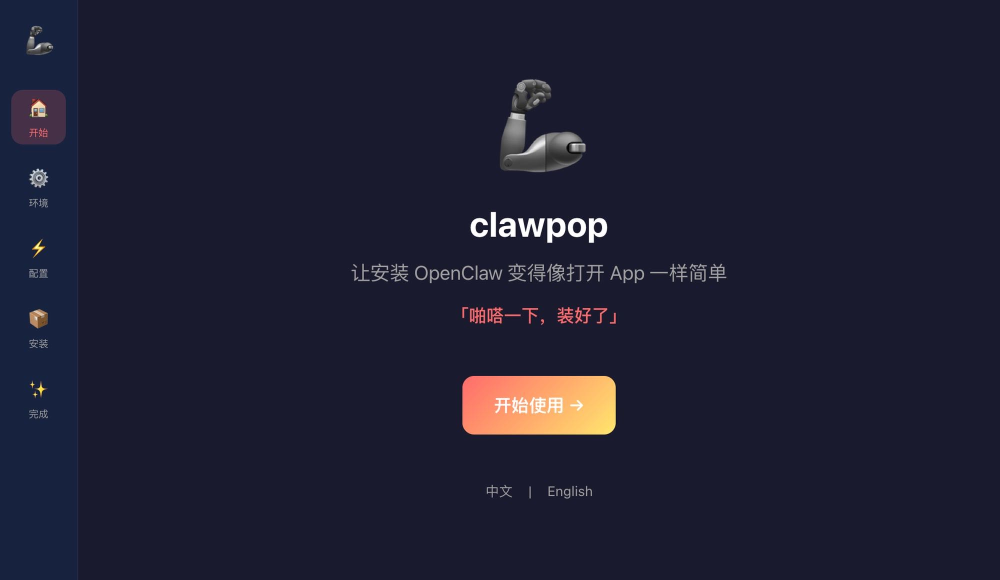
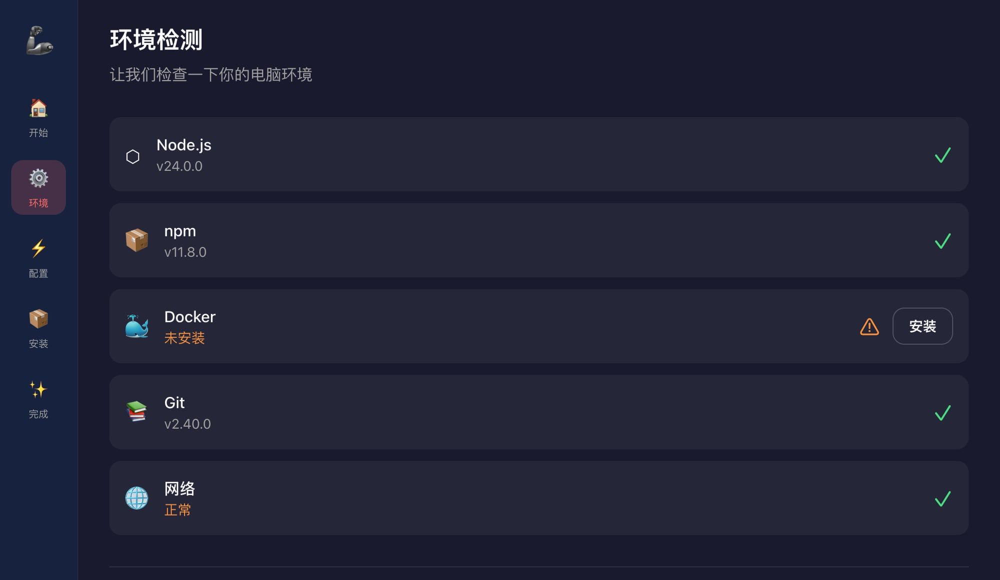
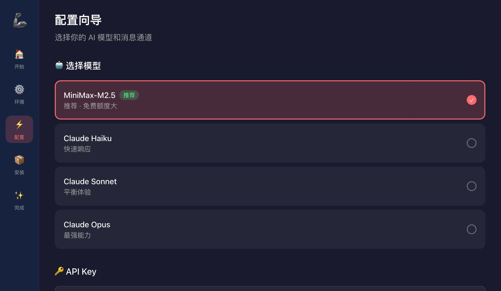
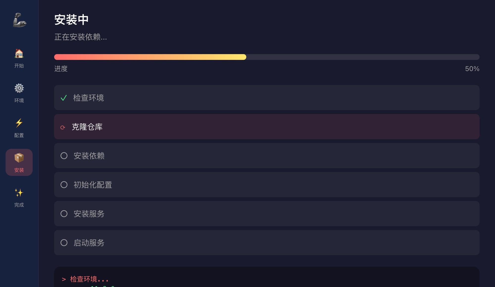

# 🦾 ClawPop

> 「啪嗒一下，OpenClaw 装好了」

让安装 OpenClaw 变得像打开 App 一样简单。精美的图形化安装向导，Apple 级体验。


## ✨ 特性

- 🎨 **Arc 风格设计** - 精美现代的深色主题
- 🚀 **一键安装** - 无需命令行知识
- 🔄 **进度可视化** - 每一步都清晰可见
- 🛡️ **错误恢复** - 安装失败可重试
- 🌐 **跨平台** - 支持 macOS 和 Windows

## 📸 截图

| 欢迎页 | 环境检测 | 配置向导 |
|:---:|:---:|:---:|
|  |  |  |

| 安装页 | 完成页 |
|:---:|:---:|
|  |  |

## 🛠 技术栈

- **框架**: [Tauri 2.x](https://tauri.app/) - 跨平台桌面应用
- **前端**: React 18 + TypeScript
- **样式**: Tailwind CSS
- **动画**: Framer Motion
- **状态**: Zustand
- **后端**: Rust

## 🚀 快速开始

### 前置要求

- Node.js 18+
- Rust 1.70+
- macOS 12.0+ 或 Windows 10+

### 安装

```bash
# 克隆项目
git clone https://github.com/hkgood/ClawPop.git
cd ClawPop

# 安装依赖
npm install

# 开发模式
npm run tauri dev

# 构建发布
npm run tauri build
```

## 📁 项目结构

```
ClawPop/
├── src/                      # React 前端
│   ├── components/           # UI 组件
│   │   ├── layout/           # 布局组件
│   │   ├── pages/            # 页面组件
│   │   └── ui/               # 基础 UI 组件
│   ├── hooks/                # 自定义 Hooks
│   ├── stores/               # Zustand 状态管理
│   └── styles/               # 全局样式
├── src-tauri/                # Rust 后端
│   ├── src/                  # Rust 源代码
│   └── tauri.conf.json       # Tauri 配置
├── screenshots/              # 项目截图
└── public/                   # 静态资源
```

## 🎯 功能流程

```
欢迎页 → 环境检测 → 配置向导 → 安装 → 完成
  ↓         ↓          ↓         ↓       ↓
 Logo    Node/Docker  模型/API   进度条   启动
 动画     Git/网络    通道       日志     引导
```

## 🤝 贡献

欢迎提交 Issue 和 Pull Request！

## 📄 许可证

MIT License - see [LICENSE](LICENSE) for details.

---

<p align="center">Made with ❤️ by <a href="https://github.com/hkgood">hkgood</a></p>
